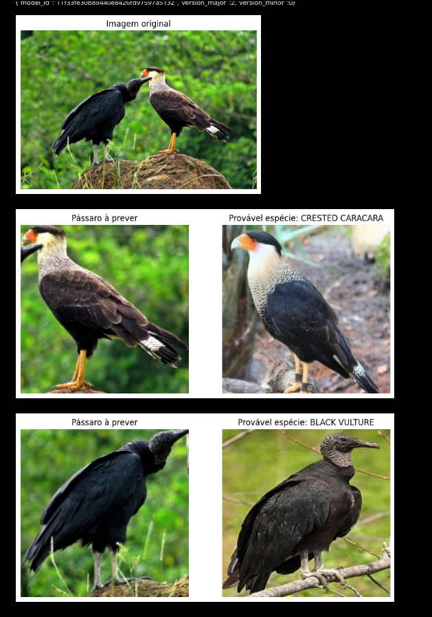

# Birds.AI
Algoritmo de DeepLearning em CNN para identificação de aves através de imagens fornecidas pelo usuário.

# Requisitos:
- Versão do python: **3.8.10**
```sh
pip install \
keras==2.13.1 \
tensorflow==2.13.1 \
numpy==1.24.3 \
scikit-learn==1.3.2 \
torch==2.0.1 \
torchvision==0.15.2 \
tqdm==4.66.4 \
scipy==1.10.1 \
pandas==2.0.3 \
matplotlib==3.7.5 \
opencv-python==4.10.0.82 \
ultralytics==8.2.28 \
ipywidgets==8.1.3
```
- Caso ainda falte alguma biblioteca não listada, tem o arquivo requirements.txt
onde tem todas as libs baixadas no pyenv de execução

## Introdução

### Contextualização:
O projeto visa desenvolver um classificador que identifique a espécie de uma ave
a partir de uma única imagem. Nesta etapa também foi considerado a sua aplicação
de maneira real, observando aspectos como uso de imagens não tratadas,
acessibilidade para usuários reais e melhorias no modelo através de integração
de novos dados ao dataset.

### Objetivo:
Criar um modelo estável que possa prever corretamente a espécie de uma ave em
mais de 85% das amostras, mantendo um balanceamento entre as classes para
garantir uma constância na maior parte das amostras. Além disso, o modelo deve
aceitar novos dados provenientes de fontes externas ao seu dataset original,
tratando imagens diversas a fim de identificar e classificar aves em imagens
enviadas por usuários, e por fim, integrar ou rejeitar dados de acordo com
avaliações internas e externas (feedback do usuário).


### Preparação para produção
O principal desafio para a aplicabilidade do modelo desenvolvido ao longo do
projeto era a necessidade de receber imagens tratadas, sendo necessário que as
aves ocupem no mínimo 50% da imagem, e que a resolução seja de 224 x 224 pixels.
Para resolver esta barreira foi implementada uma camada de identificação de
objetos anterior à fase de classificação das espécies. Para o desenvolvimento da
camada foi utilizada a rede neural convolucional yolov8 treinada com o dataset
padrão coco8, ambos provenientes da Ultralytics. Após a implementação desta
camada superior de identificação, tornou-se possível a identificação de aves de
maneira genérica nas imagens, o que também permite o recorte da ave na imagem e
a alteração na resolução. Dessa forma, a aplicação apresentou maior
flexibilidade de dados de entrada, viabilizando sua aplicação em imagens
convencionais, sem tratamento ou resolução iniciais suportadas pelo modelo de
classificação das espécies.

Para a camada de testes, foram adicionados casos de teste ausentes no dataset
original, como por exemplo, a identificação de diversas aves em uma imagem,
provenientes ou não de uma mesma espécie, a resolução máxima suportada pelo
modelo e a capacidade do modelo identificar espécies que possuem dimorfismo
sexual evidente. E também verificar se textos ou coisas envolta iriam atrapalhar
o modelo ou não.

Por fim, foi adicionado um botão visual em que facilita a interação do usuário
com o modelo. Esse botão serve como uma assimilação com um botão que seria
previamente utilizado em sites ou aplicativos. De forma muito fácil, a pessoa
clica no botão e seleciona a imagem que contém o pássaro. O modelo irá ler a
imagem, identificar onde estão os pássaros e prever a espécie de cada um deles

## Plano de monitoramento
O monitoramento das imagens adicionadas possui uma fase de validação feita pelo
usuário, ou seja, para casos discrepantes, em que o resultado de classificação
do modelo foi rejeitado pelo usuário, a imagem é separada para a identificação
correta feita por especialistas no diretório ‘unknown’. Caso a imagem seja
validada pelo usuário como correta, o dado será separado para o diretório
‘to-train’ e será utilizado para integração do dataset do modelo posteriormente.

Nessa fase de validação, um humano pode inserir várias imagens que não foram
processadas dentro da pasta to-validate e depois rodar o arquivo pipe.py. Esse
arquivo irá ler cada imagem, identificar e cortar centralizadamente cada pássaro
e identificar.

Para facilitar a validação, é mostrada a foto que será prevista e ao lado um
exemplo da espécie prevista. Com isso o usuário poderá confirmar a previsão ou
recusar, caso ele recuse, também pode dizer manualmente qual é a espécie
verdadeira. Após a confirmação, a imagem recortada é movida para a pasta
to-train ou caso a espécie não seja reconhecida, para a unknown

Também tem o arquivo de health-check que o usuário pode verificar se o modelo
continua acertando bem as espécies das novas imagens que não pertencem ao
dataset original. Caso alguma das métricas caia muito, é possível retreinar o
modelo com os novos dados a partir do arquivo retrain.ipynb

### Estratégias de manutenção e atualização
Assim como descrito no plano de monitoramento, os dados externos que forem
classificados de maneira correta, através da validação do feedback do usuário,
vão integrar os dados de treino do dataset de maneira direta, enquanto que os
dados rejeitados pelo feedback do usuário serão analisados posteriormente para
a classificação correta das espécies.

Com o re-treino, será gerado os dois novos modelos que podem ser posteriormente
testados e ao fim adicionados ao modelo final.
Tudo foi automatizado de forma simples para que no futuro o trabalho de
atualização do modelo seja mais fácil e menos burocrático.

### Conclusão

Observando os pontos de melhoria destacados nas fases anteriores da avaliação do
trabalho, uma abordagem mais ampla foi escolhida, ao enviar imagens não
processadas, isso facilita o acesso e usabilidade do modelo.
Além de um simples pipe, que resolve os problemas futuros que envolvem a
atualização e monitoramento. O pipe, juntamente com o input de imagens não
processadas possibilita salvar massas de dados muito maiores e automatizar a
entrada de novos dados.

# Imagens

